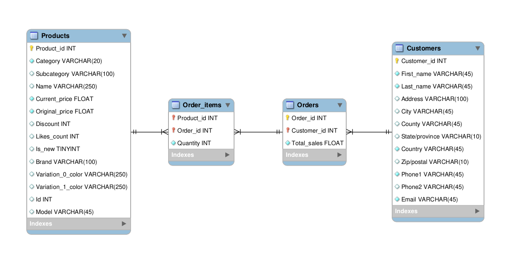
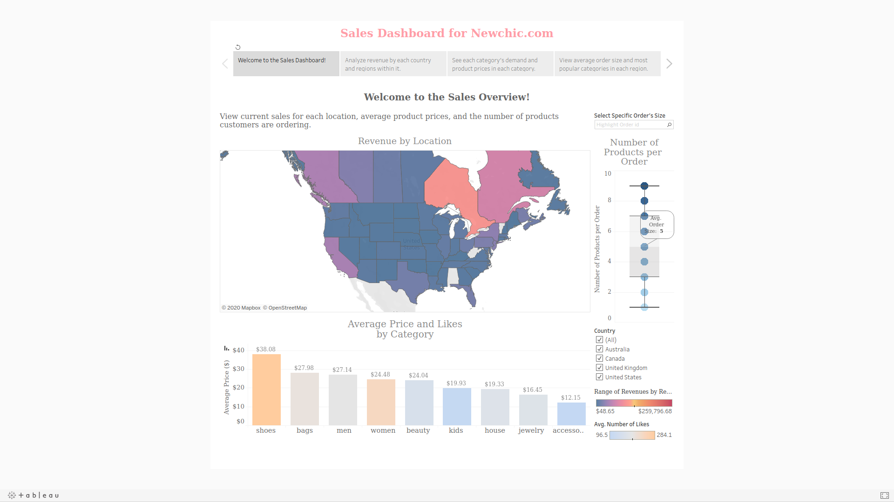

# Sales Database
Saloni Sharma

CSPB 3287 - Course Project

# Data Sources
Products: https://data.world/jfreex/products-catalog-from-newchiccom

Customers: https://www.briandunning.com/sample-data/

Sales Orders: Generated by me using Python in this [notebook](DataProcessing.ipynb)

# Database Schema
This is the schema design for the sales database.

# Tableau Dashboards
The interactive dashboards are viewable [here](https://public.tableau.com/profile/saloni.s5845#!/vizhome/3287Project_WorkBook/MainStory).

